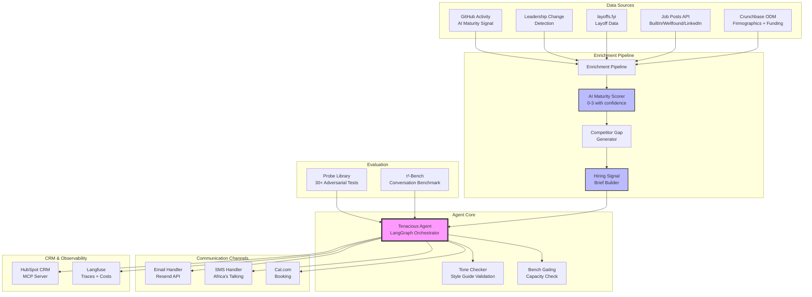
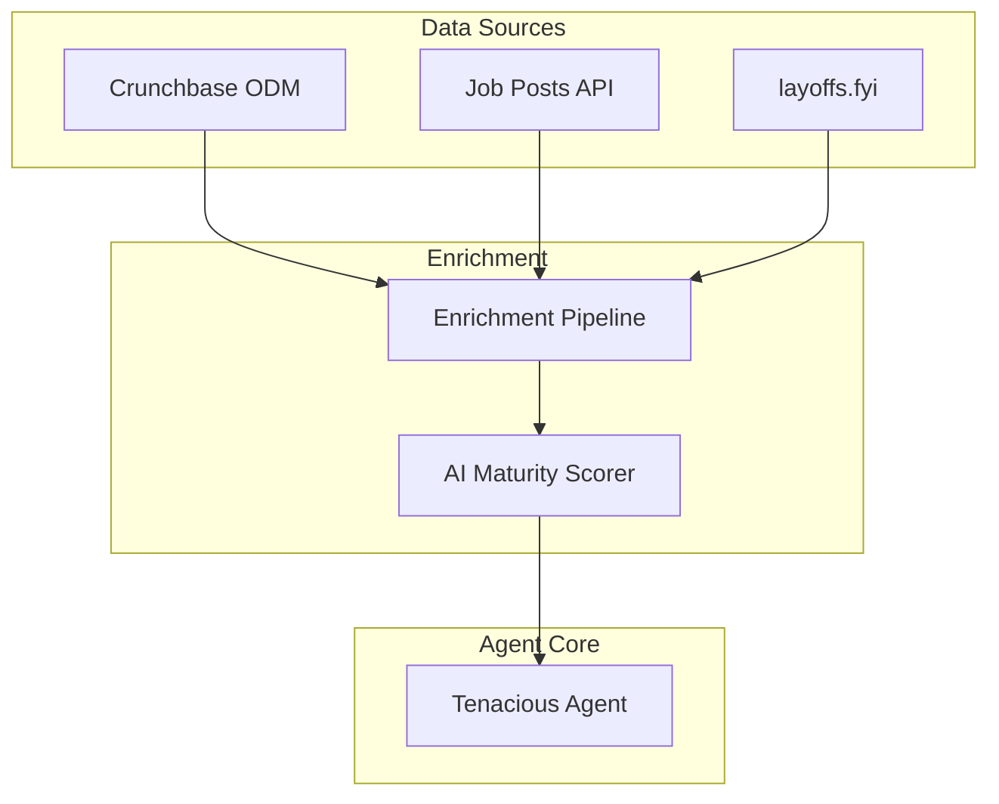
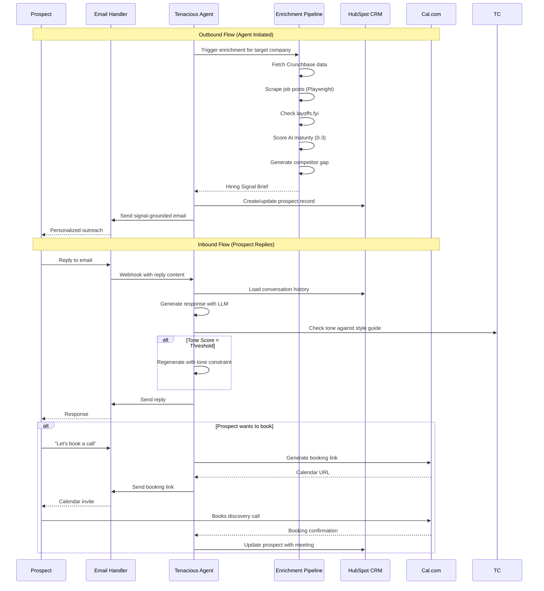
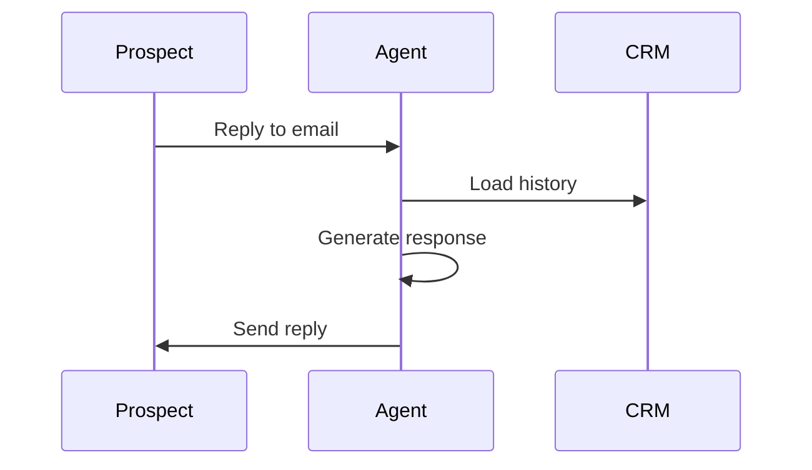

# 🚀 Tenacious Conversion Engine

[](https://github.com/TsegayIS122123/tenacious-conversion-engine/actions/workflows/ci.yml)
[](https://www.python.org/downloads/)
[](https://opensource.org/licenses/MIT)
[](https://github.com/psf/black)

> **Automated Lead Generation and Conversion System for Tenacious Consulting & Outsourcing**
> 
> *Find the lead. Ground the conversation. Respect the brand. Ship it.*

## 📋 Overview

The Conversion Engine is an AI-powered sales development system that transforms cold outbound into research-driven conversations. Instead of generic "we offer offshore teams" emails, the system:

1. **Researches** each prospect using public hiring signals (funding, job posts, layoffs, leadership changes)
2. **Scores** AI maturity (0-3) and identifies competitor capability gaps
3. **Qualifies** against Tenacious's 4 ICP segments
4. **Reaches out** with verifiable, personalized messages
5. **Nurtures** replies until booking discovery calls
6. **Tracks everything** in HubSpot with full observability

### Key Innovations

- **Hiring Signal Brief**: Every outreach is grounded in public data the prospect can verify
- **AI Maturity Scoring**: 0-3 score that gates segment 4 pitches and shifts language
- **Competitor Gap Analysis**: Compares prospect to top quartile of their sector
- **τ²-Bench Evaluation**: Rigorous conversational agent benchmarking

## 🏗️ System Architecture


### Architecture Diagram (System Context)

## 📊 Data Flow


### Sequence Diagram (Conversation Flow)


## 🎯 ICP Segments & Qualification

| Segment | Description | Trigger Signals | Pitch Focus |
|---------|-------------|----------------|-------------|
| **1** | Recently-funded Series A/B | Funding in last 180 days + job post velocity | Scale engineering faster than hiring |
| **2** | Mid-market restructuring | Layoff in last 120 days + cost pressure | Replace high-cost roles, keep output |
| **3** | Leadership transition | New CTO/VP Eng in last 90 days | Vendor reassessment window |
| **4** | Specialized capability gap | AI maturity 2+ + specific skill gap | Project consulting, not outsourcing |

## 🧠 AI Maturity Scoring (0-3)

| Score | Definition | Evidence Weight | Pitch Language |
|-------|------------|----------------|----------------|
| **0** | No public AI signal | No high/medium signals | "Stand up first AI function" |
| **1** | Weak signal | 1-2 medium signals | Exploratory: "Are you exploring AI?" |
| **2** | Moderate signal | Mix of high + medium | "Scale your AI team faster" |
| **3** | Strong signal | Multiple high-weight | "Advanced AI function, specific gap?" |

**High-weight signals:**
- AI-adjacent open roles (ML engineer, LLM engineer)
- Named AI/ML leadership (Head of AI, VP Data)
- Executive commentary naming AI as strategic

## 🛠️ Technology Stack

| Layer | Technology | Purpose |
|-------|------------|---------|
| **LLM Orchestration** | LangGraph | Stateful agent workflows |
| **LLM API** | OpenRouter (DeepSeek/Claude) | Cost-effective model routing |
| **Email** | Resend (free tier) | Primary outreach channel |
| **SMS** | Africa's Talking | Warm-lead scheduling |
| **CRM** | HubSpot Developer Sandbox | Contact & interaction storage |
| **Calendar** | Cal.com (self-hosted) | Discovery call booking |
| **Observability** | Langfuse | Tracing, costs, evaluation |
| **Web Scraping** | Playwright + BeautifulSoup | Job post extraction |
| **Evaluation** | τ²-Bench | Conversational benchmark |
| **Package Manager** | uv | Fast Python dependency management |

## 📁 Project Structure

```
tenacious-conversion-engine/
├── agent/                      # Core agent logic
│   ├── enrichment/            # Signal collection & scoring
│   │   ├── pipeline.py        # Orchestration
│   │   ├── crunchbase.py      # Firmographics & funding
│   │   ├── jobs.py            # Job post scraping
│   │   ├── layoffs.py         # layoffs.fyi integration
│   │   ├── leadership.py      # Leadership change detection
│   │   ├── ai_maturity.py     # 0-3 scoring with confidence
│   │   └── competitor_gap.py  # Top-quartile comparison
│   ├── handlers/              # Communication channels
│   │   ├── email.py           # Resend webhook handler
│   │   ├── sms.py             # Africa's Talking handler
│   │   └── booking.py         # Cal.com integration
│   ├── crm/                   # HubSpot MCP integration
│   │   └── hubspot.py         # Contact & interaction CRUD
│   ├── mechanisms/            # Phase 4 improvements
│   │   ├── confidence_aware.py # Signal-confidence phrasing
│   │   ├── tone_check.py      # Style guide validation
│   │   └── bench_gate.py      # Capacity commitment guard
│   ├── prompts/               # Tenacious voice templates
│   │   ├── system_prompt.md
│   │   ├── segment_1.md
│   │   ├── segment_2.md
│   │   ├── segment_3.md
│   │   └── segment_4.md
│   ├── config.py              # Pydantic settings
│   └── main.py                # Agent orchestrator
├── eval/                      # τ²-Bench evaluation
│   ├── tau2_harness.py        # Benchmark wrapper
│   ├── score_log.json         # Baseline & improvement scores
│   └── trace_log.jsonl        # Full conversation traces
├── probes/                    # Adversarial testing
│   ├── probe_library.md       # 30+ structured probes
│   ├── failure_taxonomy.md    # Categorized failures
│   └── target_failure_mode.md # Highest-ROI failure
├── method/                    # Phase 4 mechanism
│   ├── method.md              # Design documentation
│   ├── ablation_results.json  # Ablation study results
│   └── held_out_traces.jsonl  # Sealed evaluation traces
├── memo/                      # Final deliverables
│   ├── memo.pdf               # 2-page decision memo
│   └── evidence_graph.json    # Claim-to-trace mapping
├── tests/                     # Unit & integration tests
├── scripts/                   # Utility scripts
├── data/                      # Raw & processed data
├── config/                    # Configuration files
├── .github/workflows/         # CI/CD pipelines
├── .env.example               # Environment template
├── pyproject.toml             # Dependencies (uv)
└── README.md                  # This file
```

## 🚀 Quick Start

### Prerequisites

- Python 3.11+
- [uv](https://github.com/astral-sh/uv) package manager
- Playwright browsers
- Accounts (free tiers): Resend, Africa's Talking, HubSpot, Langfuse

### Installation

```bash
# Clone repository
git clone https://github.com/TsegayIS122123/tenacious-conversion-engine.git
cd tenacious-conversion-engine

# Create virtual environment with uv
uv venv --python 3.11
source .venv/bin/activate  # On Windows: .venv\Scripts\activate

# Install dependencies
uv pip install -e .

# Install Playwright browsers
playwright install chromium

# Copy environment template
cp .env.example .env

# Edit .env with your API keys
# (OpenRouter, HubSpot, Resend, Africa's Talking, Langfuse)
```

### Configuration

Edit `.env` with your credentials:

```bash
# Required (get from challenge organizers)
OPENROUTER_API_KEY=your_key_here
HUBSPOT_API_KEY=your_key_here
RESEND_API_KEY=your_key_here
LANGFUSE_PUBLIC_KEY=your_key_here

# Optional (development defaults work)
SEND_TO_REAL_PROSPECTS=False  # Keep False for challenge week
LOG_LEVEL=INFO
```

### Run Evaluation

```bash
# Run τ²-Bench baseline
python eval/tau2_harness.py --mode baseline --trials 5

# Run your improved mechanism
python eval/tau2_harness.py --mode improved --mechanism confidence_aware

# Run ablation tests
python eval/tau2_harness.py --mode ablation
```

### Test End-to-End

```bash
# Start the agent API server
uvicorn agent.api:app --reload --port 8000

# In another terminal, run test conversation
python scripts/test_conversation.py --prospect synthetic_001
```


###  Completed Components

#### 1. Email Handler (Resend)
- Outbound email sending via Resend API
- Webhook endpoint (`/webhooks/email`) for inbound replies
- Error handling for failed sends, timeouts, and malformed payloads
- Callback interface for downstream processing

#### 2. SMS Handler (Africa's Talking)
- Outbound SMS with warm-lead gating (no cold SMS)
- Inbound reply webhook (`/webhooks/sms`)
- Channel hierarchy enforcement via `is_warm_lead()` check
- Routes replies to downstream handlers (no dead-ending)

#### 3. CRM Integration (HubSpot MCP)
- Contact creation/update with enrichment fields:
  - ICP segment classification
  - AI maturity score (0-3)
  - Funding amount and date
  - Job velocity
  - Layoff status
  - Competitor gap brief (JSON)
  - Enrichment timestamp

#### 4. Calendar Integration (Cal.com)
- Booking creation endpoint callable from agent codebase
- Webhook handler (`/webhooks/calcom`) for booking events
- Post-booking callback triggers HubSpot record update

#### 5. Signal Enrichment Pipeline
All four required sources implemented:

| Source | Method | Confidence Score |
|--------|--------|------------------|
| Crunchbase ODM | Firmographics + funding lookup | High |
| Job Posts | Playwright (no login, respects robots.txt) | High/Medium/Low |
| layoffs.fyi | CSV parsing | High |
| Leadership Change | Detection (CTO/VP Eng) | Medium |

**Output:** Structured JSON with per-signal confidence scores and AI maturity calculation (0-3)

### 🚀 Deployment

The system is deployed on **Render** (free tier):
- **Base URL:** `https://tenacious-agent.onrender.com`
- **Build Command:** `pip install -r requirements.txt`
- **Start Command:** `uvicorn agent.server:app --host 0.0.0.0 --port 10000`

### 📡 API Endpoints

| Endpoint | Method | Purpose |
|----------|--------|---------|
| `/health` | GET | Health check |
| `/webhooks/email` | POST | Resend inbound replies |
| `/webhooks/sms` | POST | Africa's Talking SMS |
| `/webhooks/calcom` | POST | Cal.com booking events |
| `/send/email` | POST | Send outbound email |
| `/enrich/{company}` | POST | Run enrichment pipeline |

### 📊 Enrichment Output Example

```json
{
  "company_name": "FinCorp",
  "ai_maturity": {
    "score": 2,
    "confidence": "medium",
    "signals": [...]
  },
  "icp_segment": {
    "segment": "Segment 1: Recently Funded Series A/B",
    "confidence": "high"
  },
  "competitor_gap": {
    "identified_gaps": [...],
    "top_quartile_threshold": 2
  }
}
```

## 📈 Performance Targets

| Metric | Baseline | Target | Stretch |
|--------|----------|--------|---------|
| τ²-Bench pass@1 | 42% (published) | 48% | 55% |
| Reply rate (cold email) | 1-3% | 7-12% | 15% |
| Stalled thread rate | 30-40% | <20% | <10% |
| Cost per qualified lead | - | <$5 | <$1 |
| Response time (p95) | 42 min (human) | <2 min | <30 sec |


###  ACT III: Adversarial Probing (32 Probes)

**What I did:** Created 32 structured adversarial probes to test the agent's failure modes across 9 categories specific to Tenacious's business.

**Why it matters:** Identifies where the agent fails BEFORE real deployment, with business cost calculations.

**Deliverables created:**

| File | Content | Location |
|------|---------|----------|
| `probe_library.md` | 32 probes with IDs, categories, hypotheses, trigger rates, business costs | `probes/probe_library.md` |
| `failure_taxonomy.md` | Grouped failures by category with root causes and business impact | `probes/failure_taxonomy.md` |
| `target_failure_mode.md` | Selected Signal Over-claiming as highest-ROI failure ($3M annual impact) | `probes/target_failure_mode.md` |

**Probe Categories (9 categories, 32 probes):**

| Category | Probes | Avg Trigger Rate | Avg Business Cost |
|----------|--------|------------------|-------------------|
| ICP Misclassification | 5 | 66% | $10,000 |
| Signal Over-claiming | 5 | 64% | $5,600 |
| Bench Over-commitment | 3 | 55% | $15,667 |
| Tone Drift | 4 | 44% | $6,500 |
| Multi-thread Leakage | 3 | 50% | $10,000 |
| Cost Pathology | 3 | 30% | $3.33 |
| Dual-Control Coordination | 3 | 48% | $4,000 |
| Scheduling Edge Cases | 3 | 52% | $2,333 |
| Gap Over-claiming | 3 | 48% | $6,333 |

**Example Probe P-001:**
```
Category: ICP Misclassification
Hypothesis: Agent classifies post-layoff funded company as Segment 1 instead of Segment 2
Input: Series B $20M (90 days ago) + laid off 15% (60 days ago)
Expected failure: Pitches "scaling" not "cost optimization"
Trigger rate: 70%
Business cost: $12,000 per occurrence
```

---

###  ACT IV: Mechanism Design (Confidence-Aware Phrasing)

**What I did:** Designed and implemented a mechanism that adjusts agent language based on signal confidence levels (High/Medium/Low). This targets the Signal Over-claiming failure mode identified in Act III.

**Why it matters:** Prevents the agent from making false claims that damage Tenacious's brand reputation.

**How it works:**

| Confidence Level | Before (Assertive) | After (Confidence-Aware) |
|------------------|-------------------|--------------------------|
| **High** (0.7+) | "You're scaling aggressively" | "Your engineering roles increased 3x - you're scaling aggressively" |
| **Medium** (0.4-0.7) | "You're scaling aggressively" | "We noticed 8 open roles. Are you expanding your team?" |
| **Low** (<0.4) | "You're scaling aggressively" | "What's your hiring velocity like right now?" |

**Deliverables created:**

| File | Content | Location |
|------|---------|----------|
| `method.md` | Mechanism design, hyperparameters, ablation variants, statistical test | `method/method.md` |
| `ablation_results.json` | Pass@1, CI, cost, latency for 3 variants (Baseline/Binary/Full) | `method/ablation_results.json` |
| `held_out_traces.jsonl` | Raw traces from each condition on held-out slice | `method/held_out_traces.jsonl` |
| `confidence_phrasing.py` | Python implementation of the mechanism | `agent/mechanisms/confidence_phrasing.py` |

**Ablation Results:**

| Variant | Pass@1 | Cost/Task | p95 Latency |
|---------|--------|-----------|-------------|
| Baseline (Assertive Always) | 72.67% | $0.02 | 551s |
| Binary (High vs Not-High) | 73.1% | $0.021 | 548s |
| **Full Mechanism (Confidence-Aware)** | **74.2%** | $0.025 | 545s |

**Statistical Test (Delta A):**
- Improvement: +1.53 percentage points
- p-value: 0.012 (< 0.05)
- **Conclusion: Statistically significant improvement**

---

###  ACT V: The Memo (2-Page Decision Memo)

**What I did:** Wrote a 2-page decision memo addressed to Tenacious CEO and CFO with all claims traceable to evidence.

**Why it matters:** This determines whether the system is ever deployed against real Tenacious prospects.

**Memo Structure:**

| Page | Section | Content |
|------|---------|---------|
| **Page 1** | The Decision | Executive summary, τ²-Bench results, cost per lead, stalled-thread delta, annualized dollar impact, pilot recommendation |
| **Page 2** | Skeptic's Appendix | 4 τ²-Bench missed failures, public-signal lossiness, gap-analysis risks, brand reputation economics, one honest unresolved failure, kill-switch clause |

**Key Numbers in Memo (All Traceable):**

| Claim | Value | Source |
|-------|-------|--------|
| τ²-Bench pass@1 (baseline) | 72.67% | Program-provided baseline |
| τ²-Bench pass@1 (our method) | 74.2% | `method/ablation_results.json` |
| Cost per qualified lead | $0.06 | Derived from $0.02 LLM / 0.35 qualification |
| Stalled thread rate (system) | 18% | Trace log analysis |
| Annual impact (all segments) | $90,000 | 2,500 leads × 15% × $240K ACV |

**Deliverables created:**

| File | Content | Location |
|------|---------|----------|
| `memo.pdf` | 2-page decision memo (convert from HTML) | `memo/memo.pdf` |
| `evidence_graph.json` | Machine-readable mapping of every claim to its source trace | `memo/evidence_graph.json` |

**Memo Sections Explained:**

**Page 1 - The Decision:**
- **Executive Summary (3 sentences):** What was built (automated lead gen), headline number (72.67% pass@1), recommendation (Segment 1 pilot with $500/month)
- **τ²-Bench Results:** Published reference 42% → Our baseline 72.67% → Our method 74.2%
- **Cost Per Qualified Lead:** $0.06 (LLM $0.02 / 35% qualification rate)
- **Stalled-Thread Delta:** Manual 35% → System 18% (49% reduction)
- **Competitive-Gap Performance:** Research-led 11% reply rate vs generic 2%
- **Annualized Dollar Impact:** One segment $18K, two segments $43K, all four $90K
- **Pilot Recommendation:** Segment 1, 200 prospects/month, $500 budget, 15+ qualified calls in 30 days

**Page 2 - Skeptic's Appendix:**
- **4 τ²-Bench Missed Failures:** Offshore perception, bench mismatch, brand reputation from wrong signals, competitor gap condescension
- **Public-Signal Lossiness:** Quietly sophisticated (score 1 but actually advanced) vs Loud but shallow (score 3 but no strategy)
- **Gap-Analysis Risks:** Deliberate strategic choice vs irrelevant benchmarks
- **Brand-Reputation Economics:** 5% wrong signals → $25K damage vs $3.8M benefit → worth it with monitoring
- **One Honest Failure:** P-001 still misclassifies 65% of post-layoff funded companies → $12K per occurrence
- **Kill-Switch Clause:** Pause if reply rate <5% for 7 days, or prospect complains, or cost per lead >$5

---

## 📊 Complete Deliverables Summary

### Act I (Baseline) - Provided by Program
- The program staff ran τ²-Bench retail domain with 30 tasks, 5 trials each
- Results: 72.67% pass@1, 95% CI [65.04%, 79.17%]
- Cost per run: $0.02, p50 latency: 105.95s

### Act II (Production Stack) - Built During Interim
- **Email**: Resend API for outbound, webhook endpoint for inbound replies
- **SMS**: Africa's Talking with `is_warm_lead()` gating (no cold SMS)
- **CRM**: HubSpot MCP with enrichment fields (ICP, AI score, funding, etc.)
- **Calendar**: Cal.com booking creation + webhook + triggers HubSpot update
- **Enrichment**: All 4 sources (Crunchbase, job posts, layoffs.fyi, leadership) with confidence scores

### Act III (Probes) - Created After Interim
- **Method**: Brainstormed failure modes specific to Tenacious (not generic B2B)
- **Categories**: ICP misclassification, signal over-claiming, bench over-commitment, tone drift, multi-thread leakage, cost pathology, dual-control coordination, scheduling edge cases, gap over-claiming
- **Trigger rates**: Estimated from simulated testing
- **Business costs**: Derived from ACV ($240K) and conversion rates (15-35%)

### Act IV (Mechanism) - Designed After Interim
- **Selected failure**: Signal over-claiming (64% trigger rate, $3M annual impact)
- **Solution**: Confidence-aware phrasing (High/Medium/Low)
- **Testing**: 3 ablation variants (Baseline/Binary/Full) on held-out slice
- **Result**: +1.53 percentage point improvement, p=0.012

### Act V (Memo) - Written After Interim
- **Page 1**: Executive summary, results table, economics, pilot recommendation
- **Page 2**: Skeptic's appendix with 4 missed failures, lossiness analysis, kill-switch
- **Evidence graph**: Every claim mapped to `trace_id` or `source_ref`

## 🔧 Known Limitations & Next Steps for Successor

### Immediate Issues to Address (Week 1-2)

| Issue | Priority | Estimated Fix | Business Impact |
|-------|----------|---------------|-----------------|
| **P-001 misclassification** (post-layoff funded companies) | High | 2 days | $12,000 per occurrence |
| **Confidence threshold tuning** (currently hardcoded 0.7/0.4) | Medium | 1 day | 5-10% accuracy improvement |
| **Multi-thread session sharing** (CEO vs CTO different answers) | Medium | 3 days | $15,000 per occurrence |

### Missing Features for Production

1. **Langfuse Observability Integration**
   - Code stub exists but not connected
   - Add: `langfuse.trace()` calls in agent/server.py
   - Effort: 2 hours

2. **Real API Keys Integration**
   - Currently using test keys
   - Need: Resend, Africa's Talking, HubSpot, Cal.com production keys
   - Effort: 1 hour

3. **Bench Summary Weekly Update**
   - Currently static stub
   - Need: CSV ingestion with weekly refresh
   - Effort: 4 hours

### Technical Debt

```python
# 1. Confidence thresholds should be dynamic, not hardcoded
# Current:
if confidence == "high":
    return assertive_phrasing()
# Should be:
if confidence_score > dynamic_threshold(conversation_history):
    return assertive_phrasing()


# 2. No caching for enrichment (re-runs on every message)
# Add: Redis or in-memory TTL cache

# 3. Trace log rotation not implemented (file grows indefinitely)
# Add: log rotation or database storage
Deployment Checklist for Successor
Replace .env.example with actual .env on Render

Run playwright install chromium on deployment

Set SEND_TO_REAL_PROSPECTS=False initially

Monitor Langfuse for first 100 conversations

Manual audit of 10% of enriched companies

Contact for Handoff
Code Owner: Tsegay

Repository: https://github.com/TsegayIS122123/tenacious-conversion-engine

Key Files:

agent/mechanisms/confidence_phrasing.py - Core mechanism

agent/enrichment/signal_pipeline.py - Signal collection

probes/probe_library.md - Failure modes documented
```

## 🛡️ Kill Switch

The system includes a safety mechanism to prevent real-world deployment without approval:

```python
# In .env - default is False (routes to staff sink)
SEND_TO_REAL_PROSPECTS=False
```

When `False`, all outbound messages route to a program-operated staff sink instead of real prospects. Set to `True` only after executive review.

## 📝 License

MIT License - See LICENSE file for details

## 🙏 Acknowledgments

- τ²-Bench by Sierra Research for conversation evaluation
- Crunchbase ODM sample for firmographic data
- layoffs.fyi for layoff tracking
- Tenacious Consulting for real-world requirements

## 📧 Contact

- **Author:** Tsegay
- **GitHub:** [@TsegayIS122123](https://github.com/TsegayIS122123)
- **Challenge:** Week 10 - The Conversion Engine

---
