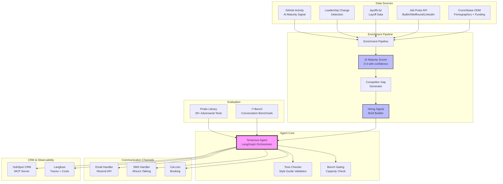
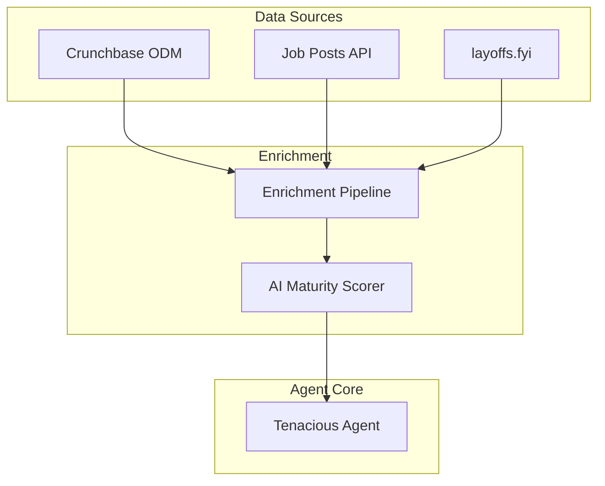
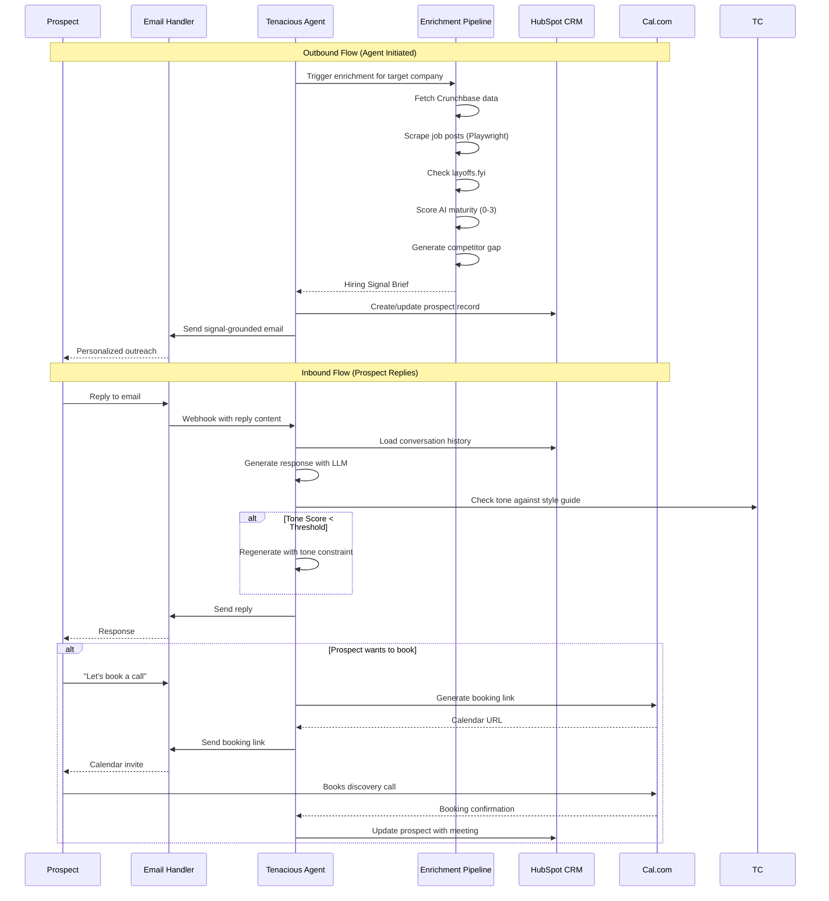
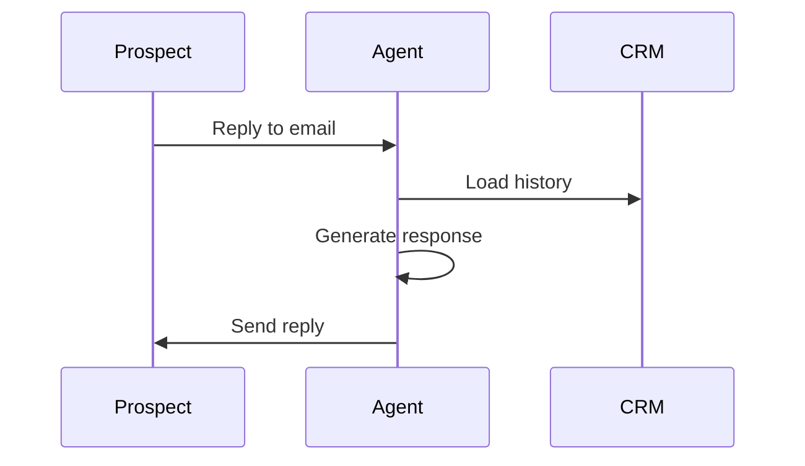

# 🚀 Tenacious Conversion Engine

[](https://github.com/TsegayIS122123/tenacious-conversion-engine/actions/workflows/ci.yml)
[](https://www.python.org/downloads/)
[](https://opensource.org/licenses/MIT)
[](https://github.com/psf/black)

> **Automated Lead Generation and Conversion System for Tenacious Consulting & Outsourcing**
> 
> *Find the lead. Ground the conversation. Respect the brand. Ship it.*

## 📋 Overview

The Conversion Engine is an AI-powered sales development system that transforms cold outbound into research-driven conversations. Instead of generic "we offer offshore teams" emails, the system:

1. **Researches** each prospect using public hiring signals (funding, job posts, layoffs, leadership changes)
2. **Scores** AI maturity (0-3) and identifies competitor capability gaps
3. **Qualifies** against Tenacious's 4 ICP segments
4. **Reaches out** with verifiable, personalized messages
5. **Nurtures** replies until booking discovery calls
6. **Tracks everything** in HubSpot with full observability

### Key Innovations

- **Hiring Signal Brief**: Every outreach is grounded in public data the prospect can verify
- **AI Maturity Scoring**: 0-3 score that gates segment 4 pitches and shifts language
- **Competitor Gap Analysis**: Compares prospect to top quartile of their sector
- **τ²-Bench Evaluation**: Rigorous conversational agent benchmarking

## 🏗️ System Architecture


### Architecture Diagram (System Context)

## 📊 Data Flow


### Sequence Diagram (Conversation Flow)


## 🎯 ICP Segments & Qualification

| Segment | Description | Trigger Signals | Pitch Focus |
|---------|-------------|----------------|-------------|
| **1** | Recently-funded Series A/B | Funding in last 180 days + job post velocity | Scale engineering faster than hiring |
| **2** | Mid-market restructuring | Layoff in last 120 days + cost pressure | Replace high-cost roles, keep output |
| **3** | Leadership transition | New CTO/VP Eng in last 90 days | Vendor reassessment window |
| **4** | Specialized capability gap | AI maturity 2+ + specific skill gap | Project consulting, not outsourcing |

## 🧠 AI Maturity Scoring (0-3)

| Score | Definition | Evidence Weight | Pitch Language |
|-------|------------|----------------|----------------|
| **0** | No public AI signal | No high/medium signals | "Stand up first AI function" |
| **1** | Weak signal | 1-2 medium signals | Exploratory: "Are you exploring AI?" |
| **2** | Moderate signal | Mix of high + medium | "Scale your AI team faster" |
| **3** | Strong signal | Multiple high-weight | "Advanced AI function, specific gap?" |

**High-weight signals:**
- AI-adjacent open roles (ML engineer, LLM engineer)
- Named AI/ML leadership (Head of AI, VP Data)
- Executive commentary naming AI as strategic

## 🛠️ Technology Stack

| Layer | Technology | Purpose |
|-------|------------|---------|
| **LLM Orchestration** | LangGraph | Stateful agent workflows |
| **LLM API** | OpenRouter (DeepSeek/Claude) | Cost-effective model routing |
| **Email** | Resend (free tier) | Primary outreach channel |
| **SMS** | Africa's Talking | Warm-lead scheduling |
| **CRM** | HubSpot Developer Sandbox | Contact & interaction storage |
| **Calendar** | Cal.com (self-hosted) | Discovery call booking |
| **Observability** | Langfuse | Tracing, costs, evaluation |
| **Web Scraping** | Playwright + BeautifulSoup | Job post extraction |
| **Evaluation** | τ²-Bench | Conversational benchmark |
| **Package Manager** | uv | Fast Python dependency management |

## 📁 Project Structure

```
tenacious-conversion-engine/
├── agent/                      # Core agent logic
│   ├── enrichment/            # Signal collection & scoring
│   │   ├── pipeline.py        # Orchestration
│   │   ├── crunchbase.py      # Firmographics & funding
│   │   ├── jobs.py            # Job post scraping
│   │   ├── layoffs.py         # layoffs.fyi integration
│   │   ├── leadership.py      # Leadership change detection
│   │   ├── ai_maturity.py     # 0-3 scoring with confidence
│   │   └── competitor_gap.py  # Top-quartile comparison
│   ├── handlers/              # Communication channels
│   │   ├── email.py           # Resend webhook handler
│   │   ├── sms.py             # Africa's Talking handler
│   │   └── booking.py         # Cal.com integration
│   ├── crm/                   # HubSpot MCP integration
│   │   └── hubspot.py         # Contact & interaction CRUD
│   ├── mechanisms/            # Phase 4 improvements
│   │   ├── confidence_aware.py # Signal-confidence phrasing
│   │   ├── tone_check.py      # Style guide validation
│   │   └── bench_gate.py      # Capacity commitment guard
│   ├── prompts/               # Tenacious voice templates
│   │   ├── system_prompt.md
│   │   ├── segment_1.md
│   │   ├── segment_2.md
│   │   ├── segment_3.md
│   │   └── segment_4.md
│   ├── config.py              # Pydantic settings
│   └── main.py                # Agent orchestrator
├── eval/                      # τ²-Bench evaluation
│   ├── tau2_harness.py        # Benchmark wrapper
│   ├── score_log.json         # Baseline & improvement scores
│   └── trace_log.jsonl        # Full conversation traces
├── probes/                    # Adversarial testing
│   ├── probe_library.md       # 30+ structured probes
│   ├── failure_taxonomy.md    # Categorized failures
│   └── target_failure_mode.md # Highest-ROI failure
├── method/                    # Phase 4 mechanism
│   ├── method.md              # Design documentation
│   ├── ablation_results.json  # Ablation study results
│   └── held_out_traces.jsonl  # Sealed evaluation traces
├── memo/                      # Final deliverables
│   ├── memo.pdf               # 2-page decision memo
│   └── evidence_graph.json    # Claim-to-trace mapping
├── tests/                     # Unit & integration tests
├── scripts/                   # Utility scripts
├── data/                      # Raw & processed data
├── config/                    # Configuration files
├── .github/workflows/         # CI/CD pipelines
├── .env.example               # Environment template
├── pyproject.toml             # Dependencies (uv)
└── README.md                  # This file
```

## 🚀 Quick Start

### Prerequisites

- Python 3.11+
- [uv](https://github.com/astral-sh/uv) package manager
- Playwright browsers
- Accounts (free tiers): Resend, Africa's Talking, HubSpot, Langfuse

### Installation

```bash
# Clone repository
git clone https://github.com/TsegayIS122123/tenacious-conversion-engine.git
cd tenacious-conversion-engine

# Create virtual environment with uv
uv venv --python 3.11
source .venv/bin/activate  # On Windows: .venv\Scripts\activate

# Install dependencies
uv pip install -e .

# Install Playwright browsers
playwright install chromium

# Copy environment template
cp .env.example .env

# Edit .env with your API keys
# (OpenRouter, HubSpot, Resend, Africa's Talking, Langfuse)
```

### Configuration

Edit `.env` with your credentials:

```bash
# Required (get from challenge organizers)
OPENROUTER_API_KEY=your_key_here
HUBSPOT_API_KEY=your_key_here
RESEND_API_KEY=your_key_here
LANGFUSE_PUBLIC_KEY=your_key_here

# Optional (development defaults work)
SEND_TO_REAL_PROSPECTS=False  # Keep False for challenge week
LOG_LEVEL=INFO
```

### Run Evaluation

```bash
# Run τ²-Bench baseline
python eval/tau2_harness.py --mode baseline --trials 5

# Run your improved mechanism
python eval/tau2_harness.py --mode improved --mechanism confidence_aware

# Run ablation tests
python eval/tau2_harness.py --mode ablation
```

### Test End-to-End

```bash
# Start the agent API server
uvicorn agent.api:app --reload --port 8000

# In another terminal, run test conversation
python scripts/test_conversation.py --prospect synthetic_001
```


###  Completed Components

#### 1. Email Handler (Resend)
- Outbound email sending via Resend API
- Webhook endpoint (`/webhooks/email`) for inbound replies
- Error handling for failed sends, timeouts, and malformed payloads
- Callback interface for downstream processing

#### 2. SMS Handler (Africa's Talking)
- Outbound SMS with warm-lead gating (no cold SMS)
- Inbound reply webhook (`/webhooks/sms`)
- Channel hierarchy enforcement via `is_warm_lead()` check
- Routes replies to downstream handlers (no dead-ending)

#### 3. CRM Integration (HubSpot MCP)
- Contact creation/update with enrichment fields:
  - ICP segment classification
  - AI maturity score (0-3)
  - Funding amount and date
  - Job velocity
  - Layoff status
  - Competitor gap brief (JSON)
  - Enrichment timestamp

#### 4. Calendar Integration (Cal.com)
- Booking creation endpoint callable from agent codebase
- Webhook handler (`/webhooks/calcom`) for booking events
- Post-booking callback triggers HubSpot record update

#### 5. Signal Enrichment Pipeline
All four required sources implemented:

| Source | Method | Confidence Score |
|--------|--------|------------------|
| Crunchbase ODM | Firmographics + funding lookup | High |
| Job Posts | Playwright (no login, respects robots.txt) | High/Medium/Low |
| layoffs.fyi | CSV parsing | High |
| Leadership Change | Detection (CTO/VP Eng) | Medium |

**Output:** Structured JSON with per-signal confidence scores and AI maturity calculation (0-3)

### 🚀 Deployment

The system is deployed on **Render** (free tier):
- **Base URL:** `https://tenacious-agent.onrender.com`
- **Build Command:** `pip install -r requirements.txt`
- **Start Command:** `uvicorn agent.server:app --host 0.0.0.0 --port 10000`

### 📡 API Endpoints

| Endpoint | Method | Purpose |
|----------|--------|---------|
| `/health` | GET | Health check |
| `/webhooks/email` | POST | Resend inbound replies |
| `/webhooks/sms` | POST | Africa's Talking SMS |
| `/webhooks/calcom` | POST | Cal.com booking events |
| `/send/email` | POST | Send outbound email |
| `/enrich/{company}` | POST | Run enrichment pipeline |

### 📊 Enrichment Output Example

```json
{
  "company_name": "FinCorp",
  "ai_maturity": {
    "score": 2,
    "confidence": "medium",
    "signals": [...]
  },
  "icp_segment": {
    "segment": "Segment 1: Recently Funded Series A/B",
    "confidence": "high"
  },
  "competitor_gap": {
    "identified_gaps": [...],
    "top_quartile_threshold": 2
  }
}
```

## 📈 Performance Targets

| Metric | Baseline | Target | Stretch |
|--------|----------|--------|---------|
| τ²-Bench pass@1 | 42% (published) | 48% | 55% |
| Reply rate (cold email) | 1-3% | 7-12% | 15% |
| Stalled thread rate | 30-40% | <20% | <10% |
| Cost per qualified lead | - | <$5 | <$1 |
| Response time (p95) | 42 min (human) | <2 min | <30 sec |

## 🛡️ Kill Switch

The system includes a safety mechanism to prevent real-world deployment without approval:

```python
# In .env - default is False (routes to staff sink)
SEND_TO_REAL_PROSPECTS=False
```

When `False`, all outbound messages route to a program-operated staff sink instead of real prospects. Set to `True` only after executive review.

## 📝 License

MIT License - See LICENSE file for details

## 🙏 Acknowledgments

- τ²-Bench by Sierra Research for conversation evaluation
- Crunchbase ODM sample for firmographic data
- layoffs.fyi for layoff tracking
- Tenacious Consulting for real-world requirements

## 📧 Contact

- **Author:** Tsegay
- **GitHub:** [@TsegayIS122123](https://github.com/TsegayIS122123)
- **Challenge:** Week 10 - The Conversion Engine

---
